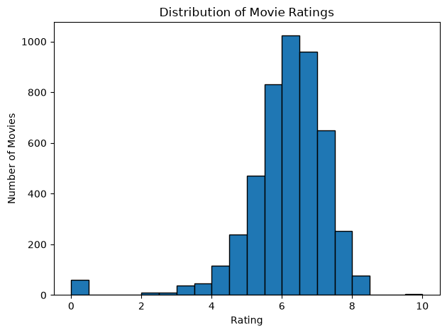
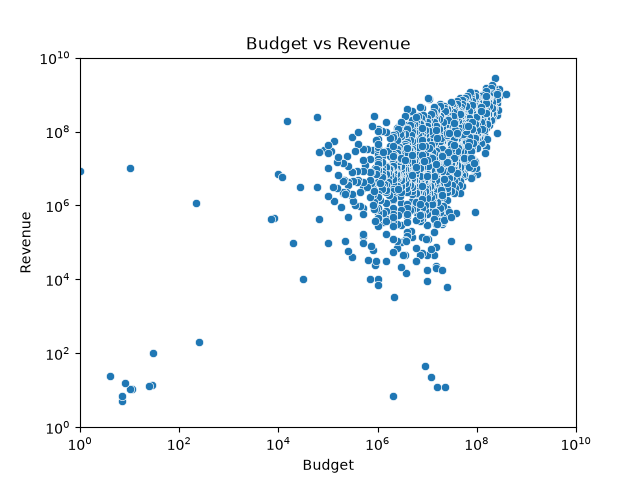
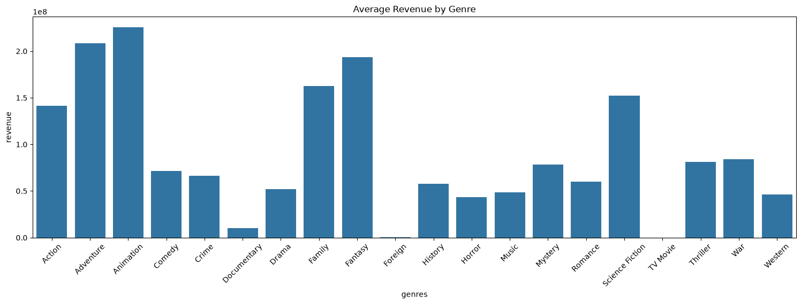
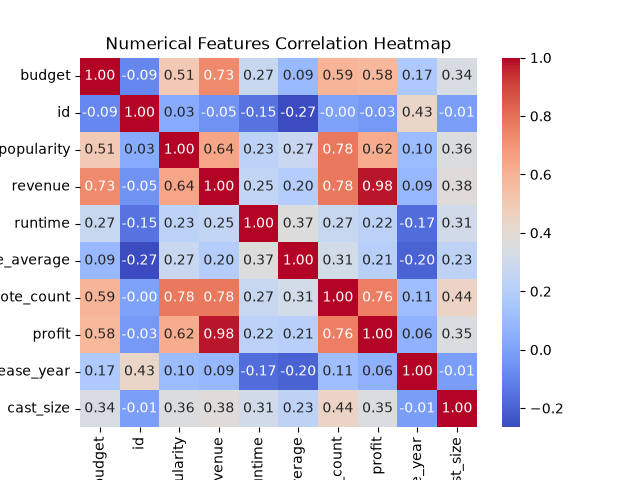
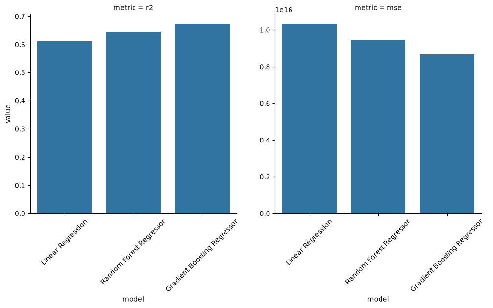
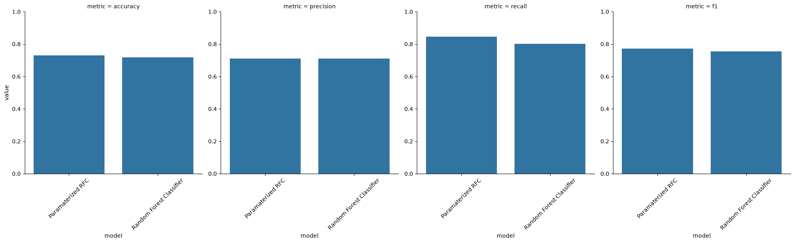

# CineML: A Progressive Machine Learning Project


An end-to-end machine learning project built around movie data — starting with data wrangling and classical ML, and working up through unsupervised learning, NLP, deep learning, and recommendation systems.

## About This Project

CineML is a self-directed learning project designed to build hands-on ML engineering skills across the full spectrum of the field, using a single coherent dataset (movie metadata, reviews, and ratings) rather than a different toy dataset for every topic. Each stage builds on the last, moving from foundational data work to progressively more advanced techniques.

## Skills Demonstrated

- **Data wrangling & EDA** — pandas, numpy, matplotlib, seaborn
- **Classical supervised learning** — scikit-learn (regression & classification, model evaluation, hyperparameter tuning)
- **Unsupervised learning** — clustering, dimensionality reduction (PCA)
- **ML engineering** — sklearn pipelines, model persistence with joblib
- **NLP** — text preprocessing, TF-IDF, sentiment classification
- **Deep learning** — PyTorch (feedforward networks, LSTMs)
- **Recommender systems** — collaborative and content-based filtering
- *(Stretch goals)* Transformer fine-tuning, CNNs, model deployment (FastAPI/Streamlit)

## Project Roadmap

- [x] Stage 0 — Environment setup
- [x] Stage 1 — Data wrangling & EDA
- [x] Stage 2 — Classical supervised learning 
- [ ] Stage 3 — Unsupervised learning *(in progress)*
- [ ] Stage 4 — Pipelines & engineering craft
- [ ] Stage 5 — NLP (sentiment analysis)
- [ ] Stage 6 — Deep learning fundamentals (PyTorch)
- [ ] Stage 7 — Recommendation systems
- [ ] Stage 8 — Stretch goals (transformers, computer vision, deployment)

## Dataset

[TMDB 5000 Movie Dataset](https://www.kaggle.com/datasets/tmdb/tmdb-movie-metadata) (Kaggle) — metadata for ~5,000 movies, including budget, revenue, genres, cast, crew, and audience ratings.

## Exploratory Data Analysis

Findings from Stage 1:







**Key findings:**
- Highest rating prevalence is 6.
- Movies tend to make about the same amount they spend + or - a little bit.
- Animation and Adventure moviers generate the most revenue, while Documentaries, TV Movie, and Foreign movies generate the least.
- The most correlation features are profit and revenue (obviously) but vote count, vote average, and popularity are all also positively correlated with profit/revenue.

Findings from Stage 2:






**Key findings:**
- Linear regression handled mediocre on this data; Gradient Boosting Regressor was the best.
- Classification models had scores around .7-.75 which is generally okay. Random Forest Classifier was the best classification model.
- After using grid search to find the best parameters, Random Forest Classifier performed better overall, increasing accuracy, recall, and f1 scores.

## Repository Structure

```
cineml/
├── data/                     # raw + cleaned datasets
├── images/                   # exported plots referenced in this README
├── 00_setup.ipynb
├── 01_eda.ipynb
├── 02_supervised.ipynb        # planned
├── 03_unsupervised.ipynb      # planned
├── 04_pipelines/               # planned
├── 05_nlp.ipynb                # planned
├── 06_deep_learning.ipynb      # planned
├── 07_recommenders.ipynb       # planned
├── requirements.txt
└── README.md
```

## Getting Started

```bash
git clone <your-repo-url>
cd cineml
python -m venv venv
source venv/bin/activate      # venv\Scripts\activate on Windows
pip install -r requirements.txt
jupyter notebook
```

## Tech Stack

Python · pandas · numpy · matplotlib · seaborn · scikit-learn · PyTorch · *(planned: HuggingFace Transformers, FastAPI/Streamlit)*

## What's Next

Continuing through the roadmap above — next up is Stage 2 (predicting box office revenue and classifying hits vs. flops).

## Author

*Keith Nicolosi — [LinkedIn](https://www.linkedin.com/in/keith-nicolosi313/)*